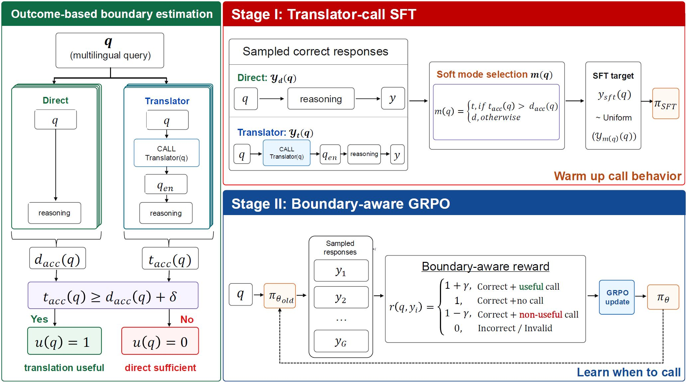

# Learning When to Translate for Multilingual Reasoning

This is the official repository for the paper:

**Learning When to Translate for Multilingual Reasoning**  
Deokhyung Kang, Hyounghun Kim, Gary Geunbae Lee  
POSTECH, South Korea

---

## Overview

This repository provides the code and resources for **Luar**, a **L**anguage **U**nderstanding Boundary-**a**ware **R**einforcement learning framework for multilingual reasoning.

**Luar** trains reasoning language models to selectively invoke translation only when their direct understanding of the original input is unreliable, improving multilingual reasoning performance while avoiding unnecessary translation.

The codebase is currently being organized and will be released within June 2026. Stay tuned!
